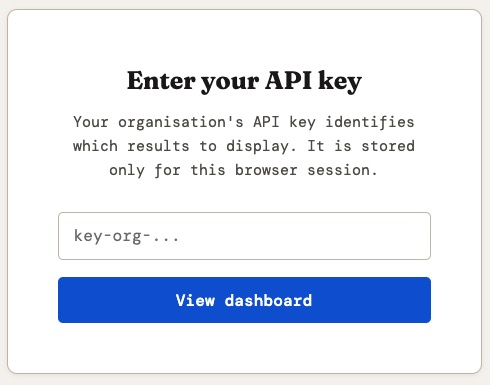
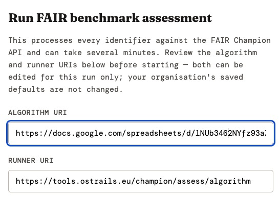
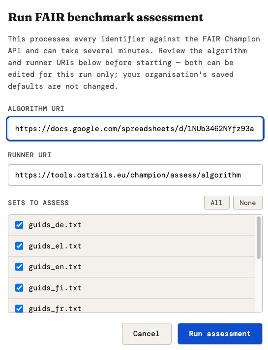
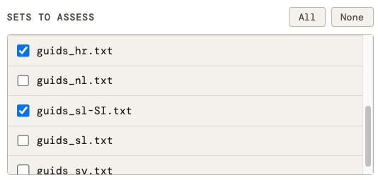
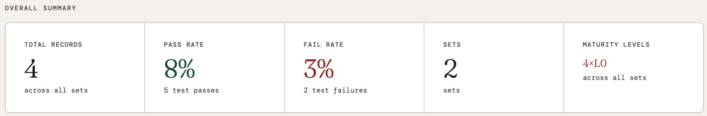
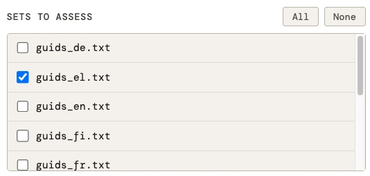
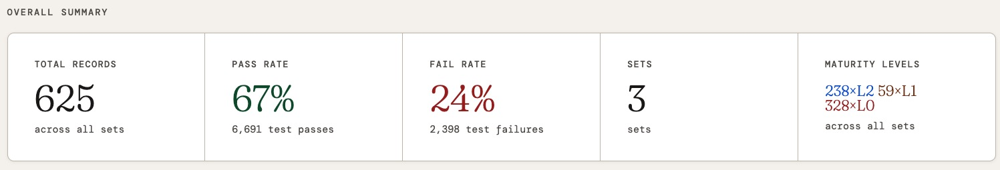
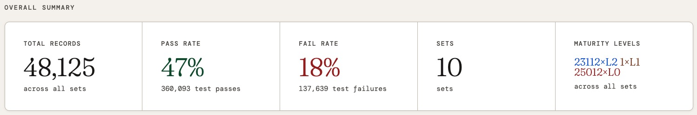

# Installation and usage guide

This guide explains how to install, configure and run the CESSDA CMV
Benchmark Runner application, and how to process a set of records
through the FAIR assessment workflow.

> Note: the application is multi-tenanted, and every stage of the
> pipeline can be driven from the browser-based dashboard once the
> application is running — including fetching identifiers, which no
> longer requires manually copying files in before you start the
> application. Each dashboard page also has its own in-app user
> guide: click the **ⓘ About** button in that page's header at any
> time for a quick reference to what is on screen. This document
> instead covers installing, configuring, and building the
> application, and adding new tenants — things the in-app guides do
> not cover.

## Prerequisites

Before you start, make sure you have the following installed:

- Java 21 or greater
- Apache Maven
- Git (to obtain the latest source)
- A modern web browser

## 1. Get the latest software version

Make sure you are working with the latest version of the code before
starting a run. If you already have a local clone, pull the latest
changes; otherwise clone the
[repository](https://github.com/cessda/cessda.cmv.benchmark-runner.git).

```bash
cd /path/to/your/workspace/cessda.cmv.benchmark-runner
git pull
```

## 2. Build the application

Open a terminal and change to the root of the code directory, for
example:

```bash
cd /path/to/your/workspace/cessda.cmv.benchmark-runner
```

Build the JAR file:

```bash
mvn clean package
```

## 3. Run the application

Start the application with:

```bash
mvn spring-boot:run
```

Once the application has started, open a browser and go to:

```text
http://localhost:8080
```

(or whichever port `server.port` is set to in `application.yaml`, if
it has been changed from the default of `8080`).

## 4. Authenticate for your tenant

You should see a key-entry challenge. Enter your organisation's API
key — the exact value configured for your tenant under `tenants.keys`
in `application.yaml`. By convention the keys shipped in this
repository's own `application.yaml` follow the pattern
`key-<tenant-id>` (for example, the tenant `cessda` uses `key-cessda`),
but this is only a naming convention for readability, not a format
the application enforces — check with whoever manages your deployment
if you are unsure of your own key.



Figure 1: Enter key for tenant

## 5. Fetch identifiers for your tenant

Before an assessment can run, the pipeline needs a set of record
identifiers to submit. There are two ways to get them:

### Option A: Fetch identifiers from the dashboard (recommended)

Click **⤓ Fetch identifiers** in the dashboard header. This opens a
page that queries your tenant's OAI-PMH endpoint live for the sets it
currently offers, lets you select which of them to fetch, and writes
the resulting identifier files for you — no manual file handling
required, and the endpoint URL can be changed for a single run
without touching any configuration file.

See that page's own guide (click its **ⓘ About** button, or read
[`About_fetch_identifiers.md`](src/main/resources/static/About_fetch_identifiers.md)
directly) for full detail on live set discovery, overriding the
endpoint URL for one run, and how a failure in one selected set is
handled without losing the others.

### Option B: Place identifier files manually

This remains useful for identifiers obtained from elsewhere — for
example, a batch fetched previously with the `GetOaiPmhIdentifiers`
command-line tool (see
[GetOaiPmhIdentifiers_README.md](GetOaiPmhIdentifiers_README.md)), or
supplied by a source other than OAI-PMH.

Each tenant has its own subdirectory under `guids/`, named after the
tenant's identifier. For example, the tenant `cessda` uses
`guids/cessda`.

1. Copy your identifier file into the appropriate tenant directory,
   for example `guids/cessda`.

2. Delete any other identifier files already present in that
   directory that you do not want included in this run.

3. Name each file using the pattern `guids_xxx.txt`, where `xxx` is
   any identifying suffix. This naming pattern must be followed even
   if you only have one file, for example `guids_1.txt`.

If you need to split a large batch into several files (for example,
to run them in separate batches), each file must still follow the
`guids_xxx.txt` naming pattern, for example:

```text
guids_1.txt
guids_2.txt
guids_3.txt
guids_4.txt
```

> Tip: Identifier files are working data rather than source code, so
> consider excluding the contents of the `guids/` directories from
> version control (for example, via `.gitignore`), keeping only a
> placeholder or `README` in each tenant folder.

## 6. Check the run configuration

Click **▶ Run assessment** in the dashboard header, and check that
the Algorithm URI and Runner URI shown are correct for this run —
they are pre-filled from your tenant's configuration.



Figure 2: Check algorithm and runner URIs

If either value is incorrect, you have two options:

- **For this run only** — change the value directly in the dialog.
- **For every future run** — edit the corresponding
  `tenants.config.<tenant-id>` section of `application.yaml`, located
  at `src/main/resources/application.yaml`.

> If you edit `application.yaml`, you must stop the application,
> rebuild the JAR file (`mvn clean package`), and restart the
> application (`mvn spring-boot:run`) before your changes take
> effect.

See [`About_index.md`](src/main/resources/static/About_index.md) (or
the dashboard's own **ⓘ About** button) for a full explanation of
every button and summary tile on this page.

## 7. Run the assessment

1. The identifier file(s) fetched or placed in step 5 should already
   be selected in the dialog.



Figure 3: All GUID files are selected by default

1. Click **Run assessment**.

1. Wait for the run to complete. Larger sets can take some time to
   process, so this is a good point to take a break.

When the run finishes, the dashboard should update to show the
results for that set.

## 8. Generate the manifest

If results are not shown automatically once the run finishes, click
**⚙ Generate manifest**. This aggregates results across all sets that
have been run for the tenant, and the dashboard should then display
them.

### Running sets incrementally

You do not need to run all of a tenant's sets in one go, and you do
not need to run them in any particular order. You can select a subset
of identifier files:



Figure 4: Select a subset of GUID files

1. Run one subset at a time.
2. Click **Generate manifest** at any point to see the results
   accumulated so far.
3. Run further subsets later, and click **Generate manifest** again
   to bring the dashboard up to date with the full set.

For example, for a tenant with multiple sets:

- After running two of the sets and generating the manifest, the
  dashboard shows results for those sets (for example, four records
  across two sets).



Figure 5: Partial results from two sets

- After running another set and generating the manifest again, the
  dashboard updates to reflect those sets (for example, 625 records
  across three sets).



Figure 6: Select another subset of GUID files



Figure 7: Partial results from three sets

- After running the remaining sets, a complete picture of the results
  is available:



Figure 8: Full results from all ten sets

## Adding and Configuring Tenants

This section explains how to add a new tenant to the CESSDA CMV
Benchmark Runner and configure its various options.

### Overview

The application supports multi-tenancy, with each tenant having its
own Benchmark Assessment Algorithm, FAIR Champion runner instance,
OAI-PMH endpoint, and dataset-specific configuration. Tenants are
configured in the `application.yaml` file under the `tenants`
section.

### Enabling Multi-Tenancy

To enable multi-tenancy, set the `enabled` flag in `application.yaml`:

```yaml
tenants:
  enabled: true
```

When enabled, each tenant operates independently with its own data,
results, and configuration.

### Adding a New Tenant

#### Step 1: Create a Tenant Key Mapping

In the `tenants.keys` section, map an API key to a tenant identifier:

```yaml
tenants:
  keys:
    "key-your-tenant": "your-tenant"
```

- **Key (left side)**: The API key used to identify the tenant in
  requests
- **Value (right side)**: The tenant ID used internally in
  configuration

Example:

```yaml
tenants:
  keys:
    "key-one": "one"
    "key-two": "two"
    "key-example": "example"
```

#### Step 2: Configure the Tenant

Under `tenants.config`, create a new section with the tenant ID:

```yaml
tenants:
  config:
    your-tenant:
      algorithm: <URL to Benchmark Assessment Algorithm>
      runner: <URL to FAIR Champion runner instance>
      oai-pmh-base-url: <this tenant's OAI-PMH base URL> # optional
      title: <Dashboard title for this tenant>
      footer: <Footer text for this tenant>
      set-names:
        # Language codes or dataset identifiers mapped to display names
      fair-map:
        # Assessment indicators mapped to FAIR categories
      maturity-levels:
        # Definition of maturity levels for this tenant
```

### Configuration Options

#### Basic Properties

##### `algorithm`

The URL of the Benchmark Assessment Algorithm spreadsheet or resource.

```yaml
one:
  algorithm: https://docs.google.com/spreadsheets/d/<ADDRESS>
```

##### `runner`

The URL of the FAIR Champion runner instance where assessments are
performed.

```yaml
one:
  runner: https://tools.ostrails.eu/champion/assess/algorithm
```

##### `oai-pmh-base-url`

The base URL of this tenant's OAI-PMH endpoint, used by the **Fetch
identifiers** dashboard page and the `/api/fetch-identifiers`
endpoints whenever a run does not explicitly override the URL. This
property is optional: if it is left unset, the application falls
back to the compiled-in CESSDA Data Catalogue endpoint.

```yaml
one:
  oai-pmh-base-url: https://datacatalogue.cessda.eu/oai-pmh/v0/oai
```

There is no assumption that a tenant's endpoint uses CESSDA's own
`language:<code>` setSpec convention — the **Fetch identifiers** page
discovers whatever sets a tenant's endpoint reports, using whatever
naming scheme that endpoint itself uses.

##### `title`

The title displayed on the dashboard for this tenant.

```yaml
one:
  title: Tenant One · Assessment Results
```

##### `footer`

Footer text displayed on the dashboard for this tenant.

```yaml
one:
  footer: CESSDA FAIR Benchmark Dashboard
```

#### Set Names

The `set-names` section maps identifiers (typically language codes or
dataset names) to human-readable display names. These are used
purely to label already-fetched result sets on the dashboard and
detail pages — a set with no matching entry here simply displays its
raw code instead of a friendly name, rather than causing an error.

```yaml
one:
   bhf: British Heart Foundation
   epsrc: Engineering and Physical Sciences Research Council
   mrc: Medical Research Council
   nerc: Natural Environment Research Council
   wellcome: Wellcome Trust
```

Each entry consists of:

- **Key**: An identifier (language code, dataset code, etc.)
- **Value**: The human-readable name to display in the dashboard

> `set-names` is unrelated to the **Fetch identifiers** page's own
> set list, which is always discovered live from the OAI-PMH
> endpoint's `ListSets` response rather than read from this
> configuration. This is deliberate: a hand-maintained `set-names`
> list can drift out of sync with the endpoint's real catalogue over
> time (a set can be renamed or retired at the source), so it does
> not need to enumerate every set the endpoint currently offers — it
> only needs entries for the sets you want a friendly label for on
> the results pages.

#### FAIR Map

The `fair-map` section maps assessment indicators to FAIR categories
(Findable, Accessible, Interoperable, Reusable).

```yaml
one:
  fair-map:
    F1_PID: F              # Persistent Identifier → Findable
    F1_GUID: F             # GUID → Findable
    F2A: F                 # Findable metric 2A
    A1_1: A                # Authentication → Accessible
    I1_A: I                # Semantic interoperability → Interoperable
    R1_2_CPI: R            # Reusability metric
```

Each entry consists of:

- **Key**: An assessment indicator code (defined in your algorithm)
- **Value**: The FAIR category letter: `F`, `A`, `I`, or `R`

This mapping is used to aggregate assessment results by FAIR category
in the dashboard.

#### Maturity Levels

The `maturity-levels` section defines which indicators must be met to
achieve each maturity level. This creates a progression path from
basic to advanced FAIR compliance.

```yaml
one:
  maturity-levels:
    level1:
      - F1_GUID
      - F2B
      - F4
      - A1_1
    level2:
      - F1_GUID
      - F2B
      - F4
      - A1_1
      - F2A
      - I1_A
      - R1_2_CPI
    level3:
      - F1_GUID
      - F2B
      - F4
      - A1_1
      - F2A
      - I1_A
      - R1_2_CPI
      - F1_PID
      - I2_A
      - R1_3_CEK
      - R1_3_CTV
      - R1_3_DMOCV
      - R1_3_DAUV
      - R1_3_DTMV
      - R1_3_DSPV
```

Each maturity level contains:

- **Key**: The level identifier (e.g., `level1`, `level2`, `level3`)
- **Value**: A list of assessment indicators that must be met to
  achieve that level

Typically, higher maturity levels include all indicators from lower
levels plus additional requirements.

### Complete Example

Here is a complete example of adding a new tenant called `my-org`:

```yaml
tenants:
  enabled: true
  keys:
    "key-one": "one"
    "key-two": "two"
    "key-myorg": "my-org"
  config:
    my-org:
      algorithm: https://example.com/my-org-algorithm
      runner: https://champion.example.com/assess/algorithm
      oai-pmh-base-url: https://oai.example.com/my-org/oai-pmh
      title: My Organisation · Assessment Results
      footer: My Organisation FAIR Benchmark Dashboard
      set-names:
        dataset-a: Dataset A
        dataset-b: Dataset B
        dataset-c: Dataset C
      fair-map:
        ORG_F1: F
        ORG_F2: F
        ORG_A1: A
        ORG_I1: I
        ORG_R1: R
      maturity-levels:
        level1:
          - ORG_F1
          - ORG_A1
        level2:
          - ORG_F1
          - ORG_F2
          - ORG_A1
          - ORG_I1
        level3:
          - ORG_F1
          - ORG_F2
          - ORG_A1
          - ORG_I1
          - ORG_R1
```

### Runtime Behaviour

Once configured, tenants operate independently:

- Each tenant's data is stored in separate directories:
  `{data-dir}/{tenant-id}/` and `{results-dir}/{tenant-id}/`
- Assessment results are computed using the tenant's specific
  algorithm and runner
- Identifiers are fetched from the tenant's `oai-pmh-base-url`,
  falling back to the compiled-in CESSDA endpoint if unset, unless
  overridden for a single run in the **Fetch identifiers** page
- The dashboard displays information using the tenant's title,
  footer, and display names
- Maturity level assessments are calculated based on the tenant's
  definitions

### API Access

When using the REST API, every `/api/**` request must include an
`X-API-Key` header carrying the tenant's key:

```bash
curl -H "X-API-Key: key-myorg" \
  https://your-instance.com/api/run-assessment/defaults
```

The application matches the API key to the corresponding tenant ID
(via `tenants.keys`) and applies that tenant's configuration to the
request. See [API_Usage.md](API_Usage.md) for worked examples of
every endpoint.

### Validation

At startup, only `title` and `footer` are strictly required for every
configured tenant — a tenant missing either one fails Spring Boot's
configuration validation, and the application will not start, with an
error naming the missing property.

`algorithm` and `runner` are not validated at startup. If a tenant
has neither its own value nor a shared top-level `benchmark.algorithm`
/ `benchmark.runner` fallback configured, the application still starts
successfully, but that tenant's **Run assessment** requests fail at
request time with an error explaining which value is missing.

`oai-pmh-base-url`, `set-names`, `fair-map`, and `maturity-levels` are
all optional and unvalidated. An unset `oai-pmh-base-url` falls back
to the compiled-in CESSDA endpoint; unset `set-names`, `fair-map`, or
`maturity-levels` simply leave the dashboard showing raw set codes, no
FAIR breakdown, or no maturity level respectively, rather than causing
a startup or request failure.

## Troubleshooting

| Symptom | Likely cause | What to do |
| --- | --- | --- |
| Not sure what a page's button or field does | — | Click the **ⓘ About** button in that page's header |
| Results not shown after a run | Manifest not yet regenerated | Click **Generate manifest** |
| Wrong Algorithm/Runner URI | Tenant config out of date | Update `tenants.config.<tenant-id>` in `application.yaml` and rebuild |
| Key not accepted | Key not present in `tenants.keys`, or mistyped | Confirm the exact key with whoever manages your deployment |
| **Fetch identifiers** shows unexpected or missing sets | Sets are discovered live from the endpoint's `ListSets` response, not from `set-names` | Check the endpoint URL itself, not the `set-names` configuration |
| A results page shows a raw set code instead of a friendly name | No matching entry in the tenant's `set-names` | Add an entry under `tenants.config.<tenant-id>.set-names` and restart |
| Config changes not visible | Application not rebuilt/restarted | Rebuild the JAR and restart `mvn spring-boot:run` |

## Command-line alternative

`GetOaiPmhIdentifiers` and `RunBenchmarkAssessment` can still be run
directly from the command line — see the
[Quick start](README.md#quick-start) section of the main README, and
each class's own README
([GetOaiPmhIdentifiers_README.md](GetOaiPmhIdentifiers_README.md),
[RunBenchmarkAssessment_README.md](RunBenchmarkAssessment_README.md))
— without starting the web application at all. This can be useful for
local testing, scripting, or driving a run from an external pipeline
(for example, a QA pipeline that submits a tenant's assessment as one
step and checks its own exit status).

`RunBenchmarkAssessment` is tenant-aware via its own `-t` /
`--tenant <tenant-id>` flag: given a tenant ID, it resolves that
tenant's `algorithm`, `runner`, and `{data,results}-dir/<tenant-id>/`
directories from `tenants.config.<tenant-id>` in `application.yaml`
— the same resolution the REST API uses for a request carrying that
tenant's `X-API-Key`. An explicit `-s` / `-r` still always overrides
the resolved algorithm/runner, whether or not `-t` is also given. If
`-t` is omitted, `RunBenchmarkAssessment` falls back to the shared
top-level `benchmark.algorithm` / `benchmark.runner` /
`benchmark.data-dir` / `benchmark.results-dir` values, exactly as
before. If `-t` names a tenant with no `tenants.config` entry, it
logs an error and exits without submitting anything.

Note that registering tenant configuration for the CLI means it now
performs the same startup validation the REST API's context does: if
any `tenants.config` entry in `application.yaml` is missing a `title`
or `footer`, `RunBenchmarkAssessment` fails to start — even for a run
that never passes `-t`. Every tenant already configured for the web
application satisfies this, since it is validated there too; this
only matters if you maintain `application.yaml` by hand and add a
tenant entry without those two fields.

`GetOaiPmhIdentifiers` remains only partially tenant-aware: its `-t` /
`--tenant` flag controls where output files are written
(`guids/<tenant>/`), but it does not read a tenant's configured
`oai-pmh-base-url` — the base URL must still be passed explicitly
with `-b` / `--oai-pmh-base-url` for anything other than the
compiled-in CESSDA default. Its `-t` is unrelated to
`RunBenchmarkAssessment`'s own `-t`, and the two are not
interchangeable.

For a genuinely per-tenant run of the full pipeline, including
identifier fetching, use the web UI or the REST API as described in
this guide.
